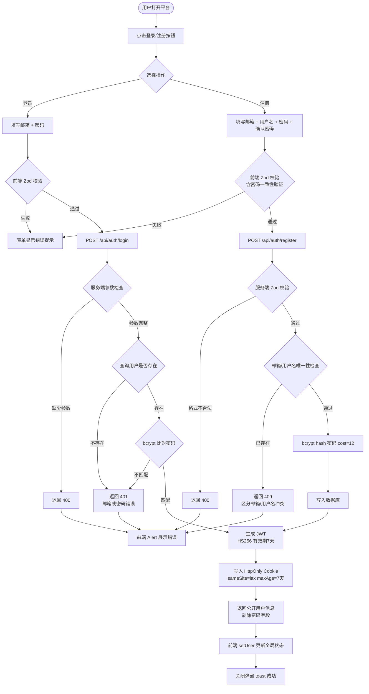
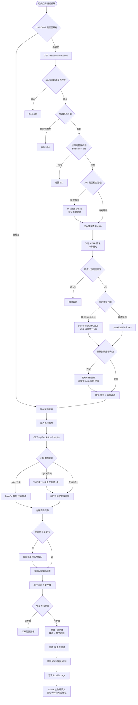
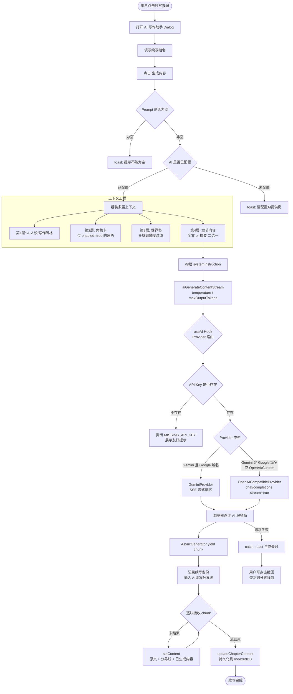
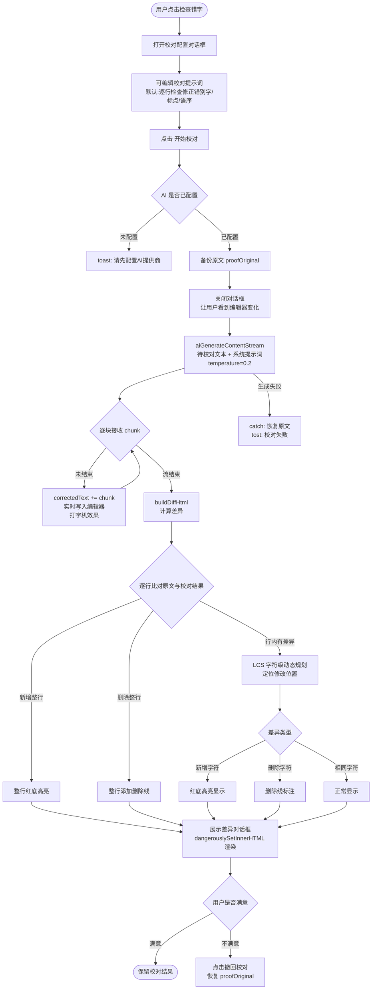
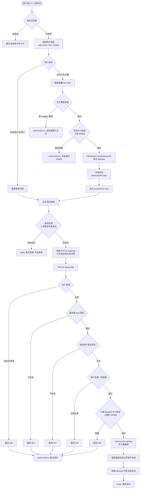
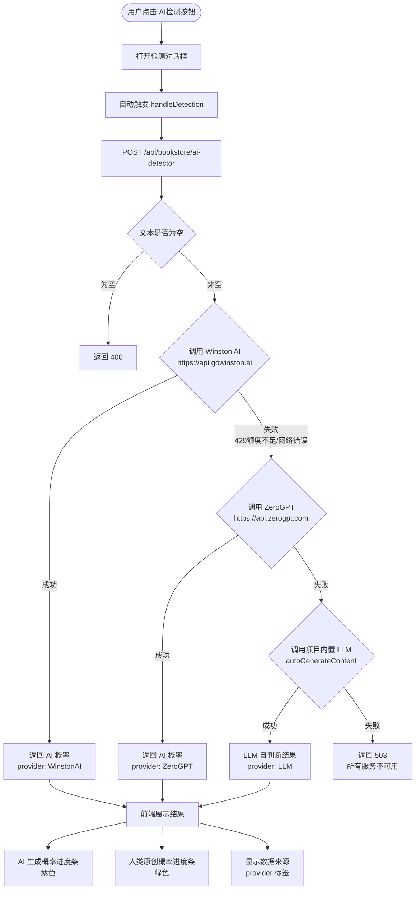

# 项目业务流程图

## 一、用户注册 / 登录流程

```mermaid
flowchart TD
    A([用户打开平台]) --> B[点击登录/注册按钮]
    B --> C{选择操作}
    C -->|登录| D[填写邮箱 + 密码]
    C -->|注册| E[填写邮箱 + 用户名 + 密码 + 确认密码]

    D --> F{前端 Zod 校验}
    E --> G{前端 Zod 校验\n含密码一致性验证}

    F -->|失败| H[表单显示错误提示]
    G -->|失败| H

    F -->|通过| I[POST /api/auth/login]
    G -->|通过| J[POST /api/auth/register]

    I --> K{服务端参数检查}
    K -->|缺少参数| L[返回 400]
    K -->|参数完整| M{查询用户是否存在}
    M -->|不存在| N[返回 401\n邮箱或密码错误]
    M -->|存在| O{bcrypt 比对密码}
    O -->|不匹配| N
    O -->|匹配| P[生成 JWT\nHS256 有效期7天]

    J --> Q{服务端 Zod 校验}
    Q -->|格式不合法| R[返回 400]
    Q -->|通过| S{邮箱/用户名唯一性检查}
    S -->|已存在| T[返回 409\n区分邮箱/用户名冲突]
    S -->|通过| U[bcrypt hash 密码 cost=12]
    U --> V[写入数据库]
    V --> P

    P --> W[写入 HttpOnly Cookie\nsameSite=lax maxAge=7天]
    W --> X[返回公开用户信息\n剥除密码字段]
    X --> Y[前端 setUser 更新全局状态]
    Y --> Z[关闭弹窗 toast 成功]

    L --> AA[前端 Alert 展示错误]
    N --> AA
    R --> AA
    T --> AA
```

---

## 二、书城抓取 / 细纲拆解流程

```mermaid
flowchart TD
    A([用户打开细纲拆解]) --> B{bookDetail 是否已缓存}
    B -->|已缓存| C[展示章节列表]
    B -->|未缓存| D[GET /api/bookstore/book]

    D --> E{sourceId/url 是否存在}
    E -->|缺失| F[返回 400]
    E -->|存在| G{书源是否启用}
    G -->|禁用/不存在| H[返回 404]
    G -->|启用| I{规则完整性检查\nbookInfo + toc}
    I -->|不完整| J[返回 501]
    I -->|完整| K{URL 是否相对路径}
    K -->|相对路径| L[从书源解析 host\n补全绝对路径]
    K -->|绝对路径| M[注入登录态 Cookie]
    L --> M
    M --> N[发起 HTTP 请求\n30秒超时]
    N --> O{响应状态是否正常}
    O -->|非 OK| P[抛出异常]
    O -->|OK| Q{规则类型判断}
    Q -->|含 @css: / @js:| R[parseRuleWithCssJs\nVM2 沙盒执行 JS]
    Q -->|普通规则| S[parseListWithRules]
    R --> T{章节列表是否为空}
    S --> T
    T -->|为空| U[JSON fallback\n直接读 data.data 字段]
    T -->|非空| V[URL 补全 + 去重过滤]
    U --> V
    V --> C

    C --> W[用户选择章节]
    W --> X[GET /api/bookstore/chapter]
    X --> Y{URL 类型判断}
    Y -->|data: 开头| Z[Base64 解码 不走网络]
    Y -->|< js > 开头| AA[VM2 执行 JS 生成真实 URL]
    Y -->|普通 URL| AB[HTTP 请求获取内容]
    Z --> AC[内容规则提取]
    AA --> AB
    AB --> AC
    AC --> AD{内容含登录提示}
    AD -->|是| AE[尝试无鉴权备用接口]
    AD -->|否| AF[CSS/JS噪声过滤]
    AE --> AF

    AF --> AG[用户点击 开始生成]
    AG --> AH{AI 是否已配置}
    AH -->|未配置| AI[打开配置面板]
    AH -->|已配置| AJ[组装 Prompt\n模板 + 章节内容]
    AJ --> AK[流式 AI 生成细纲]
    AK --> AL[正则解析结构化标题]
    AL --> AM[写入 localStorage]
    AM --> AN[Editor 读取并填入\n自动弹开续写对话框]
```

---

## 三、AI 续写完整流程

```mermaid
flowchart TD
    A([用户点击续写按钮]) --> B[打开 AI 写作助手 Dialog]
    B --> C[填写续写指令]
    C --> D[点击 生成内容]

    D --> E{Prompt 是否为空}
    E -->|为空| F[toast: 提示不能为空]
    E -->|非空| G{AI 是否已配置}
    G -->|未配置| H[toast: 请配置AI提供商]
    G -->|已配置| I[组装多层上下文]

    subgraph 上下文工程
        I --> I1[第1层: AI人设/写作风格]
        I --> I2[第2层: 角色卡\n仅 enabled=true 的角色]
        I --> I3[第3层: 世界书\n关键词触发过滤]
        I --> I4[第4层: 章节内容\n全文 or 摘要 二选一]
    end

    I4 --> J[构建 systemInstruction]
    J --> K[aiGenerateContentStream\ntemperature / maxOutputTokens]

    K --> L{useAI Hook\nProvider 路由}
    L --> M{API Key 是否存在}
    M -->|不存在| N[抛出 MISSING_API_KEY\n展示友好提示]
    M -->|存在| O{Provider 类型}
    O -->|Gemini 且 Google 域名| P[GeminiProvider\nSSE 流式请求]
    O -->|Gemini 非 Google 域名\n或 OpenAI/Custom| Q[OpenAICompatibleProvider\nchat/completions stream=true]

    P --> R[浏览器直连 AI 服务商]
    Q --> R
    R --> S[AsyncGenerator yield chunk]

    S --> T[记录续写备份\n插入 AI续写分界线]
    T --> U{逐块接收 chunk}
    U -->|未结束| V[setContent\n原文 + 分界线 + 已生成内容]
    V --> U
    U -->|流结束| W[updateChapterContent\n持久化到 IndexedDB]
    W --> X([续写完成])

    R -->|请求失败| Y[catch: toast 生成失败]
    Y --> Z[用户可点击撤回\n恢复到分界线前]
```

---

## 四、智能校对（错字检查）流程

```mermaid
flowchart TD
    A([用户点击检查错字]) --> B[打开校对配置对话框]
    B --> C[可编辑校对提示词\n默认:逐行检查修正错别字/标点/语序]
    C --> D[点击 开始校对]

    D --> E{AI 是否已配置}
    E -->|未配置| F[toast: 请先配置AI提供商]
    E -->|已配置| G[备份原文 proofOriginal]

    G --> H[关闭对话框\n让用户看到编辑器变化]
    H --> I[aiGenerateContentStream\n待校对文本 + 系统提示词\ntemperature=0.2]

    I --> J{逐块接收 chunk}
    J -->|未结束| K[correctedText += chunk\n实时写入编辑器\n打字机效果]
    K --> J
    J -->|流结束| L[buildDiffHtml\n计算差异]

    L --> M{逐行比对原文与校对结果}
    M -->|新增整行| N[整行红底高亮]
    M -->|删除整行| O[整行添加删除线]
    M -->|行内有差异| P[LCS 字符级动态规划\n定位修改位置]
    P --> Q{差异类型}
    Q -->|新增字符| R[红底高亮显示]
    Q -->|删除字符| S[删除线标注]
    Q -->|相同字符| T[正常显示]
    N --> U[展示差异对话框\ndangerouslySetInnerHTML 渲染]
    O --> U
    R --> U
    S --> U
    T --> U

    I -->|生成失败| V[catch: 恢复原文\ntost: 校对失败]
    U --> W{用户是否满意}
    W -->|满意| X([保留校对结果])
    W -->|不满意| Y[点击撤回校对\n恢复 proofOriginal]
```

---

## 五、用户资料更新流程（含头像上传）

```mermaid
flowchart TD
    A([用户进入个人资料页]) --> B{是否已登录}
    B -->|未登录| C[展示未登录引导卡片]
    B -->|已登录| D[回填用户信息\nusername / bio / avatar]

    D --> E{用户操作}
    E -->|修改用户名/简介| F[更新表单字段]
    E -->|点击上传头像| G[触发隐藏 file input]

    G --> H{文件类型检查}
    H -->|非 image/* 类型| I[setFormError: 请选择图片文件]
    H -->|通过| J{文件大小检查\n上限 200KB}
    J -->|超过限制| K[setFormError: 不能超过200KB]
    J -->|通过| L[FileReader.readAsDataURL\n转为 Base64]
    L --> M[本地预览\nsetAvatarPreview]
    M --> N[标记 avatarDirty=true]

    F --> O[点击 保存修改]
    N --> O

    O --> P{差异检测\n三项是否均未变化}
    P -->|均未变化| Q[toast: 暂无变更 不发请求]
    P -->|有变化| R[构建 PATCH payload\n只包含有变化的字段]

    R --> S[PATCH /api/profile]
    S --> T{JWT 鉴权}
    T -->|无效/未登录| U[返回 401]
    T -->|有效| V{服务端 Zod 校验}
    V -->|不合法| W[返回 400]
    V -->|通过| X{查询用户是否存在}
    X -->|不存在| Y[返回 404]
    X -->|存在| Z{用户名唯一性检查}
    Z -->|已被占用| AA[返回 409]
    Z -->|通过| AB{头像 Base64 大小检查\n上限约 300KB}
    AB -->|超限| AC[返回 400]
    AB -->|通过| AD[prisma.user.update\n写入数据库]
    AD --> AE[返回更新后的公开用户信息]
    AE --> AF[前端 setUser 同步全局状态]
    AF --> AG[toast: 更新成功]

    U --> AH[setFormError 展示错误]
    W --> AH
    Y --> AH
    AA --> AH
    AC --> AH
```

---

## 六、AI 检测多级降级流程

```mermaid
flowchart TD
    A([用户点击 AI检测按钮]) --> B[打开检测对话框]
    B --> C[自动触发 handleDetection]
    C --> D[POST /api/bookstore/ai-detector]

    D --> E{文本是否为空}
    E -->|为空| F[返回 400]
    E -->|非空| G{调用 Winston AI\nhttps://api.gowinston.ai}

    G -->|成功| H[返回 AI 概率\nprovider: WinstonAI]
    G -->|失败\n429额度不足/网络错误| I{调用 ZeroGPT\nhttps://api.zerogpt.com}

    I -->|成功| J[返回 AI 概率\nprovider: ZeroGPT]
    I -->|失败| K{调用项目内置 LLM\nautoGenerateContent}

    K -->|成功| L[LLM 自判断结果\nprovider: LLM]
    K -->|失败| M[返回 503\n所有服务不可用]

    H --> N[前端展示结果]
    J --> N
    L --> N
    N --> O[AI 生成概率进度条\n紫色]
    N --> P[人类原创概率进度条\n绿色]
    N --> Q[显示数据来源\nprovider 标签]
```
