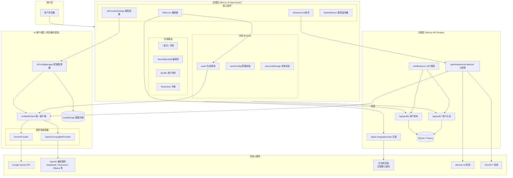
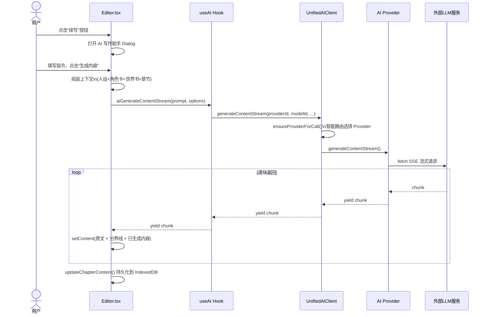
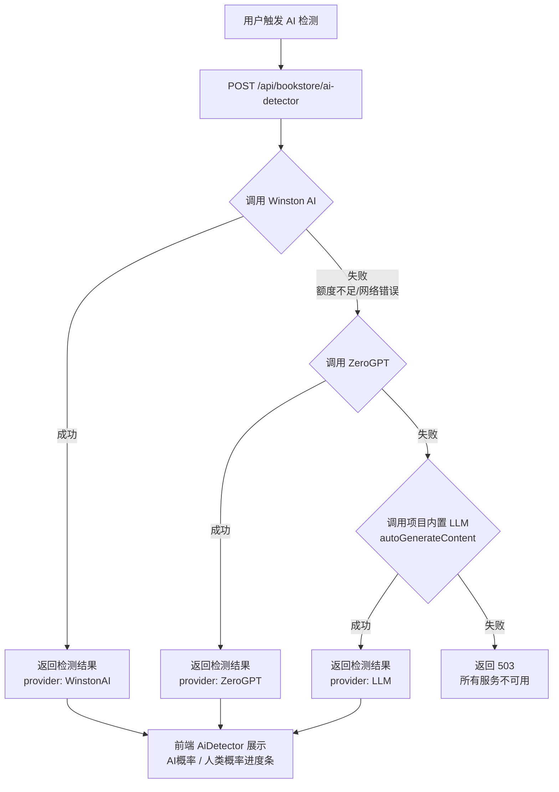
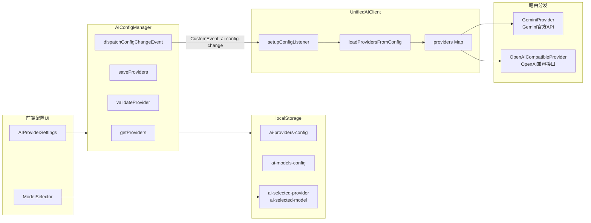
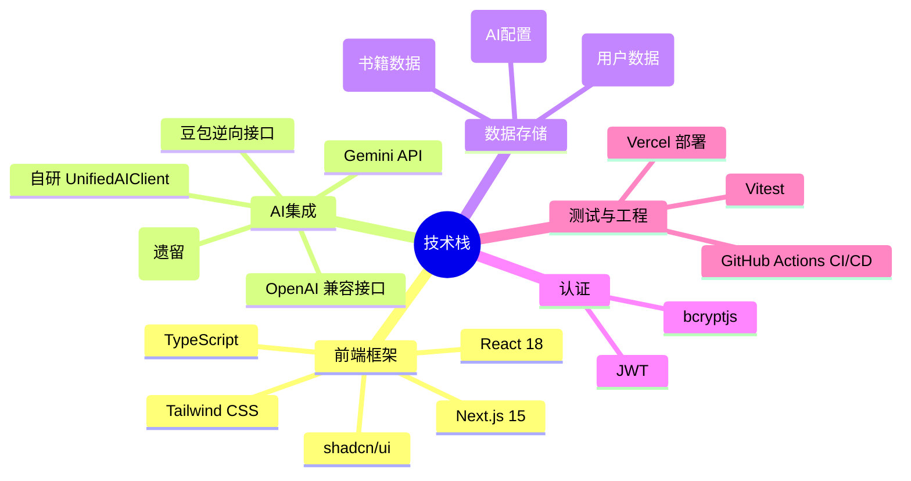

# 项目整体设计架构图

## 系统总体架构

```mermaid
graph TB
    subgraph 用户层
        U[用户浏览器]
    end

    subgraph 前端层["前端层 (Next.js 15 App Router)"]
        subgraph 页面路由
            P1["/  首页 / 书架"]
            P2["/books/[bookId]  编辑页"]
            P3["/profile  用户资料"]
            P4["/bookstore  书城"]
        end

        subgraph 核心组件
            E[Editor.tsx 编辑器]
            AI_SET[AIProviderSettings 模型配置]
            AI_DET[AiDetector AI检测]
            MS[ModelSelector 模型选择器]
        end

        subgraph 状态与Hooks
            H1[useAI 生成调用]
            H2[useAIConfig 配置读取]
            H3[useLocalStorage 本地状态]
        end
    end

    subgraph AI客户端层["AI 客户端层 (浏览器内直连)"]
        UC[UnifiedAIClient 统一客户端]
        CM[AIConfigManager 配置管理器]
        subgraph 提供商适配器
            GP[GeminiProvider]
            OP[OpenAICompatibleProvider]
        end
        LS[(localStorage 配置存储)]
    end

    subgraph 后端层["后端层 (Next.js API Routes)"]
        R1["/api/auth/*  用户认证"]
        R2["/api/ai-image/generate  生图"]
        R3["/api/bookstore/ai-detector  AI检测"]
        R4["/api/profile  用户资料"]
        MW[middleware.ts JWT鉴权]
        DB[(SQLite / Prisma)]
    end

    subgraph 外部AI服务
        G[Google Gemini API]
        O[OpenAI 兼容服务\nDeepSeek / Moonshot / Ollama 等]
        DB2[豆包网页版\n生图接口逆向]
        W[Winston AI 检测]
        Z[ZeroGPT 检测]
    end

    U --> 前端层
    E --> H1 --> UC
    AI_SET --> CM --> LS
    CM --> UC
    UC --> GP --> G
    UC --> OP --> O
    E --> R2 --> DB2
    AI_DET --> R3 --> W
    R3 --> Z
    R3 -->|兜底| UC
    前端层 --> R1 --> DB
    前端层 --> R4 --> DB
    MW --> R1
    MW --> R4
```

---

## 续写功能数据流

```mermaid
sequenceDiagram
    actor 用户
    participant Editor as Editor.tsx
    participant Hook as useAI Hook
    participant Client as UnifiedAIClient
    participant Provider as AI Provider
    participant LLM as 外部LLM服务

    用户->>Editor: 点击"续写"按钮
    Editor->>Editor: 打开 AI 写作助手 Dialog
    用户->>Editor: 填写指令，点击"生成内容"
    Editor->>Editor: 组装上下文\n(人设+角色卡+世界书+章节)
    Editor->>Hook: aiGenerateContentStream(prompt, options)
    Hook->>Client: generateContentStream(providerId, modelId, ...)
    Client->>Client: ensureProviderForCall()\n智能路由选择 Provider
    Client->>Provider: generateContentStream()
    Provider->>LLM: fetch SSE 流式请求
    loop 逐块返回
        LLM-->>Provider: chunk
        Provider-->>Client: yield chunk
        Client-->>Hook: yield chunk
        Hook-->>Editor: yield chunk
        Editor->>Editor: setContent(原文 + 分界线 + 已生成内容)
    end
    Editor->>Editor: updateChapterContent() 持久化到 IndexedDB
```

---

## AI 检测降级策略

```mermaid
flowchart TD
    A[用户触发 AI 检测] --> B[POST /api/bookstore/ai-detector]
    B --> C{调用 Winston AI}
    C -->|成功| D[返回检测结果\nprovider: WinstonAI]
    C -->|失败\n额度不足/网络错误| E{调用 ZeroGPT}
    E -->|成功| F[返回检测结果\nprovider: ZeroGPT]
    E -->|失败| G{调用项目内置 LLM\nautoGenerateContent}
    G -->|成功| H[返回检测结果\nprovider: LLM]
    G -->|失败| I[返回 503\n所有服务不可用]
    D --> J[前端 AiDetector 展示\nAI概率 / 人类概率进度条]
    F --> J
    H --> J
```

---

## AI 提供商配置管理架构

```mermaid
graph LR
    subgraph 前端配置UI
        UI[AIProviderSettings]
        MS[ModelSelector]
    end

    subgraph AIConfigManager
        GET[getProviders]
        SAVE[saveProviders]
        VALID[validateProvider]
        EVT[dispatchConfigChangeEvent]
    end

    subgraph localStorage
        P_STORE[ai-providers-config]
        M_STORE[ai-models-config]
        SEL[ai-selected-provider\nai-selected-model]
    end

    subgraph UnifiedAIClient
        LOAD[loadProvidersFromConfig]
        LISTEN[setupConfigListener]
        MAP[providers Map]
    end

    subgraph 路由分发
        GEMINI[GeminiProvider\nGemini官方API]
        OPENAI[OpenAICompatibleProvider\nOpenAI兼容接口]
    end

    UI --> AIConfigManager
    AIConfigManager --> localStorage
    EVT -->|CustomEvent: ai-config-change| LISTEN
    LISTEN --> LOAD --> MAP
    MAP --> GEMINI
    MAP --> OPENAI
    MS --> SEL
```

---

## 技术栈总览

```mermaid
mindmap
  root((技术栈))
    前端框架
      Next.js 15
      React 18
      TypeScript
      Tailwind CSS
      shadcn/ui
    AI集成
      自研 UnifiedAIClient
      Genkit(遗留)
      Gemini API
      OpenAI 兼容接口
      豆包逆向接口
    数据存储
      IndexedDB(书籍数据)
      localStorage(AI配置)
      SQLite + Prisma(用户数据)
    认证
      JWT
      bcryptjs
    测试与工程
      Vitest
      GitHub Actions CI/CD
      Vercel 部署
```
